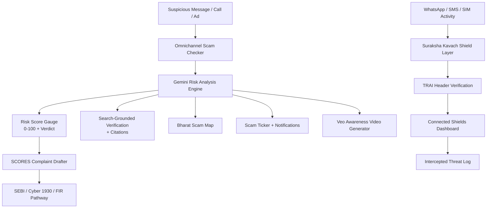

<div align="center">

# 🛡️ NYAYA (न्याय)

### Justice For Every Investor — Bharat-First Voice-Native Fraud Shield

**Protecting 41 crore Indian families from financial scams on WhatsApp, SMS, and SIM — in their own language.**

[](https://nyaya-ai-to-protect-scam-5jg9.vercel.app/)
[](https://vercel.com)
[](https://react.dev)
[](https://www.typescriptlang.org)
[](https://ai.google.dev)
[](#-pwa--offline-capabilities)
[](LICENSE)

<br/>

### 🔗 [**⚡ LAUNCH THE LIVE PLATFORM ⚡**](https://nyaya-ai-to-protect-scam-5jg9.vercel.app/)

**`https://nyaya-ai-to-protect-scam-5jg9.vercel.app/`**

<br/>

[Overview](#-overview) · [Key Features](#-core-capabilities) · [Legal & Regulatory Grounding](#️-legal--regulatory-grounding) · [Architecture](#️-system-architecture) · [Tech Stack](#-tech-stack) · [API Reference](#-api-reference) · [Setup](#-getting-started) · [Deployment](#️-deployment)

</div>

---

## 📌 Overview

Investment fraud in India doesn't announce itself in English with a Nigerian-prince cliché — it arrives as a WhatsApp forward in Hindi from a "SEBI-registered" advisor, a spoofed SMS claiming to be your bank, or a cloned voice call from a "relative" in distress. Most fraud-detection tools are built for a Western threat model and a single language; they miss almost everything that actually happens here.

**NYAYA** (न्याय — "justice") is built the opposite way: **Bharat-first, voice-native, 11-language**, and wired directly into the real Indian reporting ecosystem — SEBI SCORES, the Cyber Crime 1930 helpline, and TRAI/Sanchar Saathi spam infrastructure — so detecting a scam and actually *doing something about it* are part of the same flow.

---

## ✨ Core Capabilities

### 🎯 Omnichannel Scam Checker
Paste or describe a suspicious message, call, ad, or post from **WhatsApp, SMS, Email, Google Ads, Instagram Reels, social posts, Telegram, or a SIM-swap attempt** — Gemini returns a structured risk analysis with a 0–100 score, verdict, and reasoning.

### 🎚️ Visual Risk Score Gauge
A radial, color-coded risk gauge (D3.js) that turns an abstract AI confidence score into an instantly readable visual verdict — critical for users who won't read a paragraph of explanation under stress.

### 🛡️ Three-in-One Suraksha Kavach (Shield)
A unified protection layer spanning **WhatsApp number scanning, SIM-swap shielding, and SMS smishing filtering** — configurable from a single Connected Shields control panel, with TRAI header status checks (`Spoofed`, `Unregistered`, `Suspicious Bulk`, `Genuine`) and a live log of intercepted threats.

### 💬 WhatsApp Scam Simulator
A realistic WhatsApp-style interface for practicing scam recognition in a safe sandbox — because the best defense against a manipulative message is having seen its shape before.

### 🧠 ScamPehchano Quiz
An interactive "Recognize the Scam" quiz that builds pattern-recognition skill through repetition rather than a one-time warning.

### 📜 SCORES Complaint Drafter
Walks a victim step-by-step through drafting a formal complaint aligned with **SEBI's SCORES** portal — category, amount lost, platform, incident date, and narrative — producing a dossier that tracks through `Draft → Filed with SEBI → Under Investigation → FIR Registered (1930) → Restitution Claimed → Closed`.

### 🎙️ Vernacular Voice & Audio Transcription
Speech-to-text transcription tuned for Indian languages, so a victim can describe what happened out loud instead of typing a stressful narrative on a phone.

### 🔍 Search-Grounded Verification
Google Search grounding lets NYAYA verify claims — a company name, a "SEBI registration number," a phone number — against real, current web sources rather than relying on the model's training data alone, with citations attached.

### 🎬 AI Awareness Video Generator (Veo)
Generates short investor-awareness videos in both landscape (16:9) and portrait Reel (9:16) formats — because the same scam patterns spread fastest in video, so the warning needs to travel the same way.

### 🗺️ Bharat Scam Map
A live geographic visualization of reported scam activity across India, surfacing regional patterns as they emerge.

### 📊 Impact Calculator
Translates abstract fraud statistics into a concrete, personal estimate of financial exposure and potential savings from early detection.

### 🔔 Notification Center & Scam Ticker
A running live ticker of trending scam patterns plus a centralized notification feed, keeping awareness current rather than static.

### 📡 Offline Threat Cache
A cached, offline-accessible set of known threat warnings (`threat-warnings-cache.json`) so core protection information remains available even without connectivity.

### 📣 One-Tap Threat Alert Sharing
Share a detected threat directly to warn others — turning every individual detection into community-wide awareness.

### 🌐 11-Language Interface
Full UI and AI interaction across **English, Hindi, Tamil, Marathi, Bengali, Telugu, Gujarati, Kannada, Punjabi, Malayalam, and Hinglish** — because fraud protection that only works in English protects only a fraction of the people who need it.

### 🤖 NYAYA AI Hub & Guardrails Chat
A central hub of all AI tools plus a conversational assistant for live Q&A, governed by **Sangyan Guardrails** — explicit safety boundaries for what the assistant will and won't advise on.

---

## ⚖️ Legal & Regulatory Grounding

NYAYA is modeled around the real Indian investor-protection pipeline rather than a generic "report abuse" button:

| System | Role |
|---|---|
| **SEBI SCORES** | Formal securities-fraud complaint filing |
| **Cyber Crime 1930** | National cybercrime helpline — FIR registration pathway |
| **TRAI / Sanchar Saathi** | Spoofed-number and spam-header verification, SIM-fraud reporting |

---

## 🏗️ System Architecture



**Flow:** a message or activity enters through the checker or shield layer → Gemini scores the risk and search-grounds any factual claims → the verdict feeds the visual gauge, the scam map, and the live ticker → if real financial loss occurred, the SCORES drafter turns the incident into a formal, filing-ready complaint routed toward SEBI and Cyber 1930.

---

## 🧰 Tech Stack

| Layer | Technology |
|---|---|
| **Frontend** | React 19, TypeScript, Tailwind CSS, Lucide Icons |
| **Visualization** | D3.js (radial risk gauge) |
| **Backend** | Node.js, Express.js, Vite middleware |
| **AI** | Google Gemini — multi-tier models for search-grounded scam analysis, regulatory reasoning, conversational advisory, vernacular speech-to-text, and Veo-based video generation |
| **PWA** | Installable manifest + offline threat-warning cache |
| **Deployment** | Vercel (`vercel.json` included) |

---

## 📱 PWA & Offline Capabilities

NYAYA installs as a Progressive Web App with a one-tap install button, and ships a static `threat-warnings-cache.json` so core scam-pattern warnings remain accessible even when a user loses connectivity — exactly the moment a scam call is most likely to happen.

---

## 🚀 Getting Started

### Prerequisites
- **Node.js 18+**
- A **Google Gemini API key** — [get one here](https://aistudio.google.com/apikey)

### Installation

```bash
# 1. Clone the repository
git clone https://github.com/sathi2305/NYAYA-AI-TO-PROTECT-SCAM.git
cd NYAYA-AI-TO-PROTECT-SCAM

# 2. Install dependencies
npm install

# 3. Configure environment
echo "GEMINI_API_KEY=your_key_here" > .env

# 4. Start the dev server
npm run dev
```

The app runs at **http://localhost:3000**

### Environment Variables

```env
GEMINI_API_KEY=
```

> 🔐 `.env` is gitignored — never commit API keys. Rotate immediately if one is ever exposed.

---

## 🔌 API Reference

**Base URL:** `https://nyaya-ai-to-protect-scam-5jg9.vercel.app/api`

| Method | Endpoint | Description |
|---|---|---|
| `POST` | `/analyze-scam` | Analyze a single message/channel for fraud risk |
| `POST` | `/analyze-omnichannel-scam` | Analyze activity spanning multiple channels at once |
| `POST` | `/chat` | Conversational AI assistant (guardrail-governed) |
| `POST` | `/search-grounding` | Verify a claim against live web search with citations |
| `POST` | `/transcribe` | Vernacular speech-to-text transcription |
| `POST` | `/generate-video` | Generate an AI awareness video |
| `POST` | `/video-status` | Poll video generation status |
| `POST` | `/video-download` | Retrieve the completed video |

---

## 🗂️ Project Structure

```
NYAYA-AI-TO-PROTECT-SCAM/
├── server.ts                          # Express API — analysis, chat, search, transcribe, video
├── api/index.ts                       # Vercel serverless entry point
├── vercel.json                        # Vercel routing configuration
├── vite.config.ts                     # Vite + React + Tailwind config
├── .env.example                       # Environment template
└── src/
    ├── main.tsx / App.tsx             # Entry point & root routing
    ├── types.ts                       # Risk, complaint, shield, and language types
    ├── utils/i18n.ts                  # 11-language translation layer
    ├── data/mockData.ts               # Seed scam patterns & demo data
    ├── hooks/ (useOnlineStatus · usePWAInstall)
    └── components/
        ├── Hero.tsx / HomeHub.tsx         # Landing & home navigation
        ├── Navbar.tsx / Footer.tsx
        ├── OmnichannelScamChecker.tsx     # Core risk analysis tool
        ├── RiskScoreGauge.tsx             # D3 radial risk gauge
        ├── ThreeInOneKavach.tsx           # Unified shield controls
        ├── ConnectedShieldsPage.tsx       # Shield configuration dashboard
        ├── WhatsAppSimulator.tsx          # Scam-recognition sandbox
        ├── ScamPehchanoQuiz.tsx           # Recognition quiz
        ├── ScoresComplaintDrafter.tsx     # SEBI SCORES complaint builder
        ├── AudioTranscribeTool.tsx        # Vernacular voice transcription
        ├── SearchGroundingTool.tsx        # Search-grounded verification
        ├── VeoVideoGenerator.tsx          # AI awareness video generator
        ├── BharatScamMap.tsx              # Geographic scam visualization
        ├── ImpactCalculator.tsx           # Financial impact estimator
        ├── ScamTicker.tsx / NotificationCenter.tsx
        ├── ShareThreatAlertButton.tsx     # One-tap alert sharing
        ├── OfflineThreatCacheBanner.tsx   # Offline cache indicator
        ├── AIHubPage.tsx                  # Central AI tools hub
        ├── GeminiChatbot.tsx              # Conversational assistant
        ├── SangyanGuardrails.tsx          # AI safety boundaries
        ├── PersonasSection.tsx / RoadmapSection.tsx
        └── PWAInstallButton.tsx
```

---

## ☁️ Deployment

Deployed on **Vercel**.

| Setting | Value |
|---|---|
| **Framework Preset** | Vite |
| **Build Command** | `npm run build` |
| **Environment Variables** | `GEMINI_API_KEY` (set as a secret) |

**Live URL:** https://nyaya-ai-to-protect-scam-5jg9.vercel.app/

> The project's own documentation also references a Google Cloud Run deployment used during development — see the in-repo `README.md` for those links if still active.

---

## 🗺️ Roadmap

- [ ] Direct API integration with SEBI SCORES and Cyber Crime 1930 for live complaint submission (currently guided drafting)
- [ ] Real-time Bharat Scam Map fed by live, aggregated report data
- [ ] Expanded vernacular voice coverage beyond current language set
- [ ] Browser extension for inline WhatsApp Web / email scanning
- [ ] Community-verified threat database with crowd-sourced confirmation
- [ ] Persistent account system for tracking a victim's complaint across its full lifecycle

---

## 🤝 Contributing

```bash
git checkout -b feature/your-feature-name
git commit -m "Add: clear description of your change"
git push origin feature/your-feature-name
# Open a Pull Request
```

New UI strings should be added across all 11 language entries in `src/utils/i18n.ts`.

---

## 📄 License

Distributed under the MIT License. See [`LICENSE`](LICENSE) for details.

---

## 👤 Author

**Sathiyamoorthi**

[](https://github.com/sathi2305)

---

<div align="center">

### ⭐ If this project helps you, consider starring the repository.

**[🛡️ Try the Live Platform](https://nyaya-ai-to-protect-scam-5jg9.vercel.app/)**

*न्याय — justice shouldn't depend on which language you speak.*

</div>
